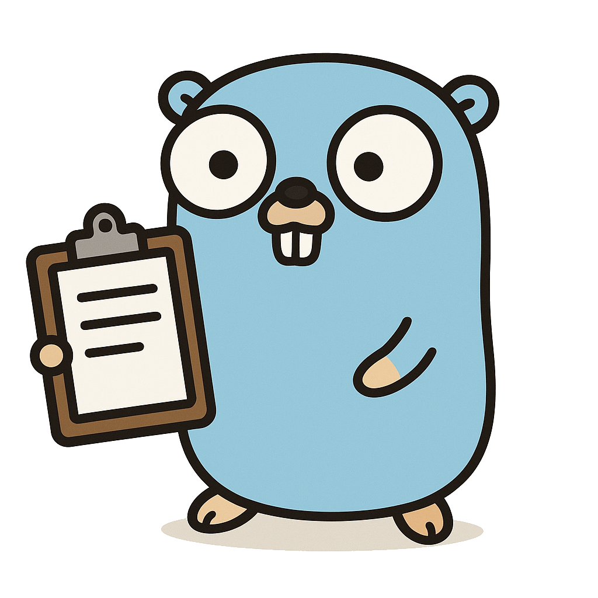

# Clipboard Clearer

  
    
  
  
  
  
  

"Clipboard Clearer" is a program that clears the content of your OS clipboard after a given amount of time. It can run on
 Linux, Windows and macOS. Accessible from the system tray, which is where the expiration time can be configured.

## TODOs

- [x] GitHub Actions pipeline to lint, tests and release
- [x] Handle image clipboard
- [x] Make clipboard liveness time configurable via the system tray
- [ ] Store non-expired timers in a queue so that, when the duration is updated, their expiration are too
- [ ] Create App bundle for macOS in CI/CD workflow
- [ ] Make an option to keep a history (configurable size) of the clipboard text content to avoid loss